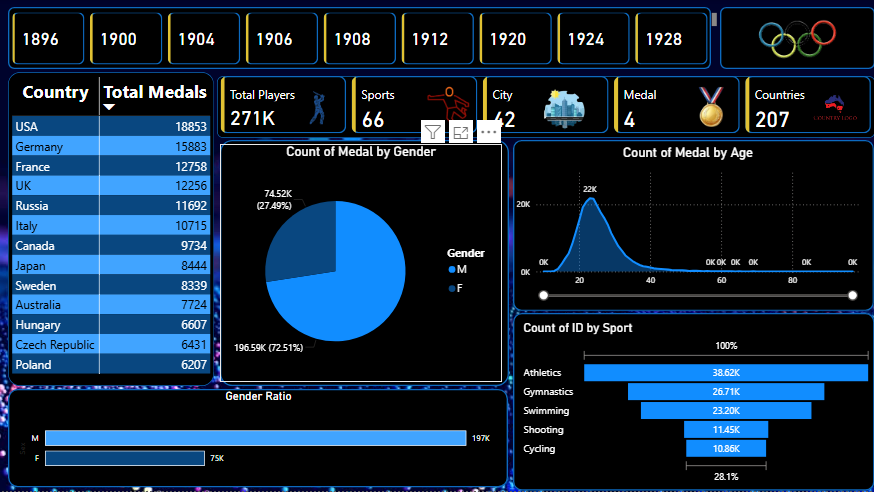

# 🏅 Olympics Data Analysis Dashboard (Power BI)

## 📌 Project Overview
This project is an **interactive Power BI dashboard** built using the **Olympics dataset (1896–2024)**.  
The dashboard provides deep insights into Olympic history, including **medal trends, country-wise performance, gender distribution, and sport participation**.

---

## 🎯 Key Features
- 📊 Medal distribution by **country, gender, and age groups**  
- 🌍 Comparison of **top-performing nations** across years  
- 🏆 Insights into **66+ sports** and athlete participation  
- 🔍 Interactive filters for exploring data by **year, sport, and country**  
- 📈 Trend analysis of athletes and medals over time  

---

## 📷 Dashboard Preview
  

*(Add your actual screenshot here from the repo folder)*

---

## ⚙️ Tech Stack
- **Power BI** – Data visualization & dashboard design  
- **DAX** – Custom measures and calculated columns  
- **Excel/CSV** – Dataset preprocessing  

---

   git clone 
